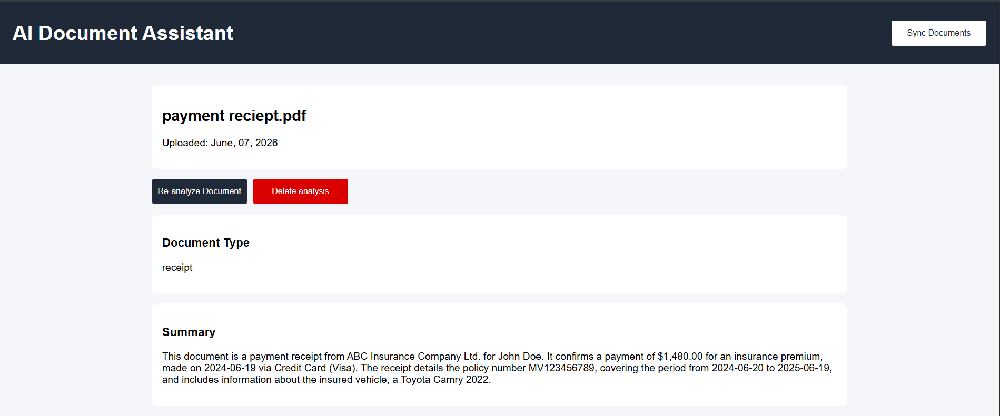
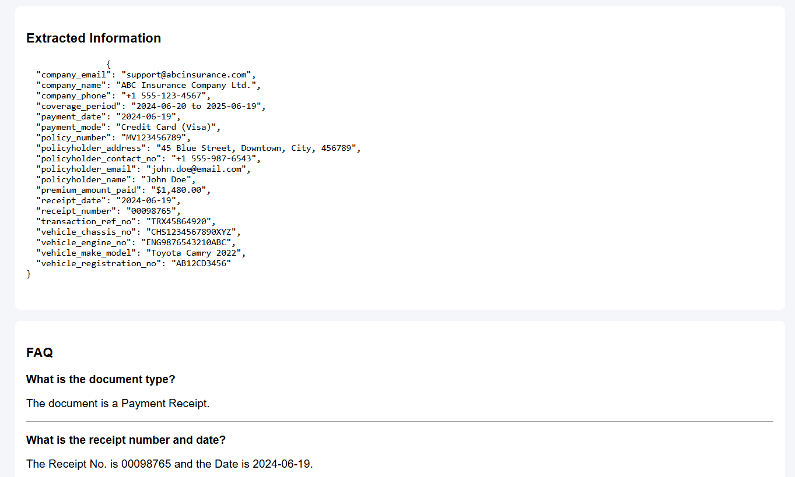
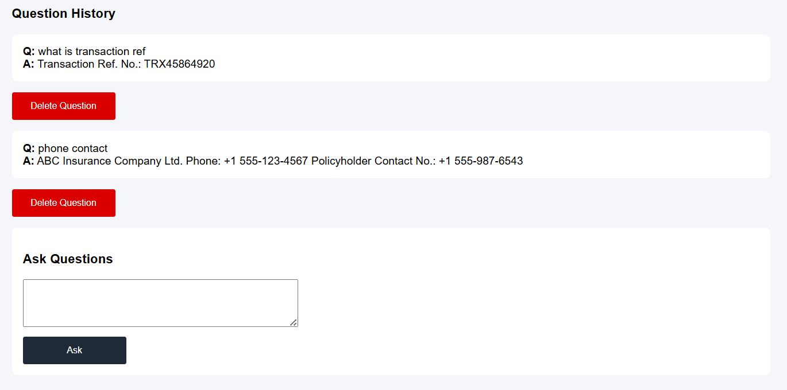

# AI Document Intelligence Platform

An AI-powered document analysis platform built with **FastAPI**, **SQLAlchemy**, **SQLite**, and **Google Gemini**.

The platform allows users to upload documents, generate summaries, extract key information, perform comprehensive document analysis, and ask questions about document contents using AI.

---

### AI-Powered Analysis
- Document summarization
- Key information extraction
- Document type classification
- FAQ generation
- Natural language document Q&A

### Supported Formats
- PDF
- DOCX
- TXT

### Supported Document Types
The system can analyze a wide variety of business documents including:

- Insurance Policies
- Contracts
- Invoices
- Receipts
- Reports
- General Business Documents

---
## Screenshots




---

## Installation

### Prerequisites

* Python 3.14+
* uv

Install uv if you don't already have it:

```bash
pip install uv
```

### Clone the Repository

```bash
git clone https://github.com/Festus-Antwi/ai-document-intelligence-platform.git
```


### Install Dependencies

Install all project dependencies from `pyproject.toml`:

```bash
uv sync
```

### Configure Gemini API Key

Create a `.env` file in the project root.

Get a Gemini API key from:

https://aistudio.google.com/

```env
GEMINI_API_KEY=your_gemini_api_key
```

### Start Application
To start the application:

```bash
uv run uvicorn main:app --reload
```
The application will be available at:

```text
http://127.0.0.1:8000
```

## Future Improvements

- User authentication
- Role-based access control
- PostgreSQL support
- OCR support for scanned PDFs
- Batch document processing
- Export analysis reports
- Dashboard analytic
- etc
